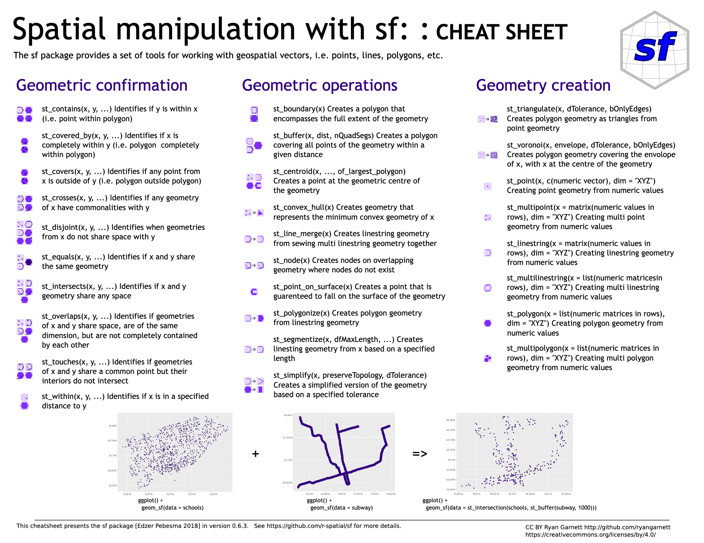

```{r setup, include=FALSE}
knitr::opts_chunk$set(echo = TRUE)
```

# Learning Objectives

1.  **Understand spatial queries** including measurement and relationship queries.

2.  **Perform basic spatial analysis** such as calculating distances, areas, and lengths within spatial datasets.

3.  **Apply proximity analysis techniques** such as creating buffers and identifying nearby features.

4.  **Join and aggregate** data based on spatial relationships

------------------------------------------------------------------------

Throughout this workshop series, we will use the following icons:

🔔 **Question**: A quick question to help you understand what's going on.

🥊 **Challenge**: Interactive exercise. We'll go through these in the workshop!

⚠️ **Warning**: Heads-up about tricky stuff or common mistakes.

💡 **Tip**: How to do something a bit more efficiently or effectively.

📝 **Poll**: A zoom poll to help you learn.

🎬 **Demo**: Showing off something more advanced so you know what you can use R for in the future

------------------------------------------------------------------------

# Part 1: Spatial Measurement Queries

## 1.1 What are spatial measurement queries?

Spatial measurement queries involve calculations such as distances, areas, and other geometric properties to provide insights into the spatial relationships within a dataset(s).

Ask questions like:

-   What is feature A's **length**?
    -   What is the length of the BART train line between Walnut Creek and Rockridge?
-   What is feature A's **distance** from feature B?
    -   What is the distance between Berkeley High School and Berkeley BART Station?
-   What is feature A's **area**?
    -   What is the area of Alameda County?

## 1.2 Area Measurement

Let's look at the answer to that last question: what is the area of Alameda County?

We'll start by loading back in our California counties dataset. We'll also plot the geometries to confirm that the dataset contains all California counties

```{r}
library(sf)

# Read in the counties shapefile
counties <- st_read("../data/california_counties/california_counties.shp")

plot(counties$geometry)
```

Next, we need to select only data pertaining to Alameda County and save it to a new spatial dataframe. We can do this by performing an "**attribute query**", which involves selecting or filtering data based on [non-spatial attributes or properties]{.underline} of a dataset.

```{r}
alameda <- counties[counties$NAME == 'Alameda',]

plot(alameda$geometry)
```

A **spatial measurement query** is similar to an attribute query, but instead allows users to subset data and create new relationships based on spatial metrics and calculations (e.g. distances, areas). Let's use the `st_area()` function to calculate the area of Alameda County:

```{r}
st_area(alameda)
```

This gives the area of the county in square meters. Why? Each CRS generally has an associated set of measurement units; in this case, the CRS of the counties dataset uses square meters for area.

It's more useful to return the area of large regions in square KM (or sq miles) and we can do that with the `set_units()` function from the `units` package:

```{r}
units::set_units(st_area(alameda), km^2)
```

⚠️ **Warning**: manual unit conversions (e.g. dividing the m^2^ by 10^6^ to get km^2^) using the `sf` package don't translate well - converted values may still be reported as m2. Always use the `set_units()` function for unit conversion!

```{r}
## Produces the same value, but the units are wrong!
st_area(alameda)/1000000
```

------------------------------------------------------------------------

### 🥊 Challenge 1: Calculate square miles

Now you try it!

Calculate the area of Alameda County in **square miles**.

-   What should you change `km^2` to?
-   Hint: you can take a look at the webpage [Measurement units in R](https://cran.r-project.org/web/packages/units/vignettes/measurement_units_in_R.html) to get a sense of more units

```{r}

# YOUR CODE HERE

```

------------------------------------------------------------------------

We can also use `st_area()` to add the area of **all** counties to the spatial dataframe:

```{r}

#create a new column that contains the area in km^2
counties$area_km2 <- units::set_units(st_area(counties), km^2)

# take a look at the added column
head(counties)
```

Spatial measurements are greatly dependent on the coordinate reference system (CRS). They can differ greatly depending on the CRS. Let's take a look at the areas in different CRS's using a script with multiple functions.

```{r}
# Calculate area using data in UTM NAD83 zone 10 CRS (26910)
counties$area_km2_utm <- units::set_units(st_area(st_transform(counties,26910)), km^2)

# Calculate area using data in Web Mercator CRS (3857)
counties$area_km2_web <- units::set_units(st_area(st_transform(counties, 3857)), km^2)

# Take a look at a subset of the Name and area columns only
head(counties[,c("NAME", "area_km2", "area_km2_utm", "area_km2_web")])
```

Output Interpretation:

-   **NAD83 / CA Albers:** The source data's CRS, CA Albers, is optimized for accurate area measurements within California. Values in the **`area_km2`** column are highly precise, assuming accurate underlying geometry.

-   **UTM10:** This CRS is optimized for Northern California, making it less accurate as you move away from the zone's center (e.g., Southern California).

-   **Web Mercator:** While preserving shape, Web Mercator significantly distorts area. It's unsuitable for precise area calculations.

The important takeaway is that you need to use a CRS that is appropriate for your analysis/mapping needs!

When creating a spatial analysis work flow it is common to start by transforming all of your data to the same, appropriate CRS.

------------------------------------------------------------------------

## 1.3 Length Measurement

We can use the `st_length()` operator in the same way as `st_area()` to calculate the length of features in a spatial dataframe. Always take note of the output units!

Let's determine how many miles of metro lines there are using Bay Area Rapid Transit (BART) data

[Read in the BART lines data]{.underline}

```{r}
# Read in the BART lines data into a new variable
bart_lines <- st_read("../data/bart_lines_2019.geojson")  #note the different file type

# Create a quick plot of the bart_lines geometry
plot(bart_lines$geometry)
```

🔔 **Question**: What type of geometry is the bart_lines dataset?

------------------------------------------------------------------------

### 🥊 Challenge 2: Examine and modify length measurements

Similar to the `st_area()` function, the `st_length()` allows you to determine the length of a line geometry.

-   Create new columns called `length_utm`, and `length_web` that contain the length of the bart_lines geometry in the (default) NAD83, UTM, and Web Mercator CRS's we used above. How different are the results?

[Examine lengths using different units]{.underline}

```{r}
# YOUR CODE HERE
bart_lines$length_nad83 <- ______
bart_lines$length_utm <- ______
bart_lines$length_web <- ______

head(bart_lines[c("length_nad83", "length_utm", "length_web")])
```

------------------------------------------------------------------------

## 1.4 Distance Measurement

The `st_distance()` function can be used to find the distance between two geometries or two sets of geometries. Let's compute the distance between two schools.

```{r}

# Read in the school_sf shapefile
schools_sf <- st_read("../data/california_schools/california_schools.shp")

# Identify the column name containg the name of the schools
colnames(schools_sf)
```

We can use the function `st_distance()` to compute the distance between two points. Let's try this out by measuring the distance between two high schools in our dataset: Alameda High School, and Berkeley High School.

```{r}
# Create new objects for each high school
alameda_high <- schools_sf[schools_sf$SchoolName=='Alameda High',]
berkeley_high <- schools_sf[schools_sf$SchoolName=='Berkeley High',]

# Determine the distance between Alameda and Berkeley High Schools
st_distance(alameda_high, berkeley_high)
```

You can also use `st_distance()` to find the distance between multiple features. Let's find out the distance between Berkeley High School and each BART line. First, we need to make sure that both dataframes are in the **same CRS**. We'll use UTM for this purpose (EPSG Code = 26910):

```{r}
# Update CRSs to match each other
berkeley_high_utm <- st_transform(berkeley_high, 26910) # Assign the CRS based on EPSG code
bart_lines_utm <- st_transform(bart_lines, st_crs(berkeley_high_utm)) # Assign schools_utm CRS

# Calculate the distance between Berkeley High and each portion of the BART line
st_distance(berkeley_high_utm, bart_lines_utm)
```

This provides the distance (in meters) from the location of Berkeley High School to each of the 6 BART lines. Note the format of the output: it is structured as a matrix, because the `st_distance()` function has the capability to measure the distance between many different points simultaneously!

We can see this by running `st_distance()` for the full `schools_sf` dataset. Don't forget to change the CRS first!

```{r}
# Update the schools_sf CRS
schools_utm <- st_transform(schools_sf, st_crs(bart_lines_utm))

# Look at the distances for the first 10 schools
head(st_distance(schools_utm, bart_lines_utm), 10)
```

------------------------------------------------------------------------

# Part 2: Spatial Relationship Queries

Measurement queries focus on the distance, area, and length of geometries. By contrast, [spatial relationship queries](https://en.wikipedia.org/wiki/Spatial_relation) consider how two geometries (or sets of geometries) [relate to one another]{.underline} in space.

Relationship queries ask questions like:

-   Is feature A **within** feature B?
    -   *What schools are in the city of Berkeley?*
-   Does feature A **intersect** with feature B?
    -   *In which cities is Tilden Regional Park located?*
-   Does feature A **cross** feature B?
    -   *Do any BART train lines cross into Albany?*

{height="300px"}

These can be used to select features in one dataset based on their spatial relationship to another.

Let's take a look at a few relationship queries.

------------------------------------------------------------------------

## 2.1 Spatial Intersections

Geometry A spatially intersects Geometry B if any of its parts (e.g., a point, line segment, or polygon) is equivalent to, touches, crosses, is contained by, contains, or overlaps any part of Geometry B.

This is the most general of all spatial relationships!

The `st_intersects()` function is used to determine intersections, and can be used to specify explicit relationships (e.g. touches) by setting the operation or `op=()` argument to any of the options listed in the `?st_intersects` help documentation (e.g. `st_touches`, `st_crosses`).

The format for filtering by spatial intersection is a bit different than we're used to. We choose the object we want to filter, and then put three arguments in brackets `[]` immediately after:

-   The name of the spatial object we want our dataframe to spatially intersect with

-   The name of the columns we want to keep in the output (optional; leave blank to keep all columns)

-   The type of spatial operation we want to perform (such as `st_intersects()`)

Let's examine a spatial intersection by determining which schools intersect Alameda county:

```{r}
# Update CRSs
counties_utm <- st_transform(counties, st_crs(schools_utm))
alameda_utm <- counties_utm[counties_utm$NAME == "Alameda",]

# Select only the schools that *intersect* Alameda county
alameda_schools_utm <- schools_utm[alameda_utm, , op = st_intersects]
```

We can double-check that our intersection worked by looking at the number of observations in our full `schools_utm` dataframe compared with the output of the intersection.

```{r}
# How many schools are in California?
nrow(schools_utm)

# How many schools are in Alameda County?
nrow(alameda_schools_utm)
```

The syntax we used was to

-   Select the features (i.e. rows) in the `schools_utm` dataframe

-   whose geometry **spatially intersects** the `alameda_utm` geometry

-   and keep all of the other `schools_utm` columns (because the extraction brackets have no second argument)

If we only wanted to keep the name and level of the schools, the filtering operation would look like this:

```{r}
alameda_schools_utm <- schools_utm[alameda_utm, c("SchoolName", "Level"), op = st_intersects]
```

Let's create a quick plot to visualize what our selection returned (red) compared with the full set of schools (blue):

```{r}
## Run this entire code chunk at once

# Alameda county
plot(alameda_utm$geometry)
# All schools
plot(schools_utm$geometry, col = "blue", add = TRUE)
# Alameda schools
plot(alameda_schools_utm$geometry, col = "red", add = TRUE)
```

------------------------------------------------------------------------

### 🥊 Challenge 3: Use `st_disjoint()`

Unlike the `st_intersects()` function, `st_disjoint()` subsets the features in A that do *not* share space with B. It selects the features that have no spatial intersection.

1.  Subset the counties data by selecting only `"Los Angeles"` in the `counties_utm10` county dataframe. Save this dataframe as `la_utm`

2.  Select all schools that do *not* share space with (e.g. NOT in) Los Angeles County. Save this dataframe as `schools_utm_not_la`

3.  Plot Los Angeles County in "blue" and non-Los Angeles County schools in `"red"`.

```{r}

la_utm <- ____

schools_utm_not_la <- ____[____, , op = ____]

plot(la_utm, border = "blue")
plot(schools_utm_not_la, col = "red", add = TRUE)

```

------------------------------------------------------------------------

[Here](https://github.com/rstudio/cheatsheets/blob/master/sf.pdf) is an `sf` cheatsheet that lists and briefly explains common relationship functions



Let's expand on our analyses by combining measurement and relationship queries.

------------------------------------------------------------------------

## 2.2 Combining Measurement and Relationship Queries

Measurement queries return a continuous value (e.g. area) while relationship queries evaluate to true or false, and then return the features for which the relationship is true. Let's take a look at a common analysis that combines those concepts: **proximity analysis**.

Proximity analyses ask questions like

-   What schools in Berkeley are within 1/2 mile (approximately 800 meters) of a BART station?

Proximity analysis helps identify nearby features---to find all features within a certain maximum distance of features in another dataset

A common workflow for this type of analysis is:

1.  Buffer around the features in the reference dataset to create buffer polygons. (`st_buffer()`)

2.  Run a spatial relationship query to find all features that intersect (or are within) the buffer polygons.

------------------------------------------------------------------------

Let's conduct a proximity analysis to think through the concept of a walkable city. One aspect of a walkable city is that services (e.g. public transportation) are accessible within a certain walk distance.

Let's start considering how 'walkable' Alameda county schools are by looking at their proximity to BART lines.

```{r}
# Create a buffer around the bart lines of 800 meters (~1/2 mile)
bart_lines_utm_buffer = st_buffer(bart_lines_utm, dist = 800)
```

```{r}
# Plot Alameda county, BART lines, and BART stations 
bart_alameda_plot <- ggplot() +
  geom_sf(data = alameda_utm) + 
  geom_sf(data = bart_lines_utm) +
  theme_minimal()

bart_alameda_plot #creating a plot as a separate variable could make it easier to add to the plot
```

```{r}

#add the 800m bart lines buffer
bart_alameda_plot <- bart_alameda_plot + 
  geom_sf(data = bart_lines_utm_buffer, fill = "pink", alpha = 0.5)

bart_alameda_plot
```

```{r}

#add the continuing education schools 
bart_alameda_plot <- bart_alameda_plot +
  geom_sf(data = alameda_schools_utm, color = "purple", size = 0.2)

bart_alameda_plot
```

Great! Looks like we're all ready to run our spatial relationship query to complete the proximity analysis. At this point (pun intended) we'll select the schools that are in within the BART line buffer polygons.

```{r}

#select the schools that intersect with the bart lines buffer
alameda_schools_utm_bart_buffer <- alameda_schools_utm[bart_stations_utm_buffer, , op = st_intersects]
```

Now let's overlay again, to see if the schools we selected make sense.

```{r}
# Highlight the schools intersect the BART line buffer in yellow
bart_alameda_plot <- bart_alameda_plot +  
  geom_sf(data = alameda_schools_utm_bart_buffer, color = "yellow", size = 0.2)

bart_alameda_plot
```

### 🥊 Challenge 4: BART Stations and Schools

This analysis is interesting, but there is a major problem! It doesn't matter if a school is within walking distance of a BART *line* - it matters whether a school is within walking distance of a BART **station**! Let's redo the analysis, this time with BART stations instead.

```{r}
# Step 1: Read in BART stations dataframe
bart_stations <- st_read("../data/bart_stations_2019.geojson")

# Step 2: Convert CRS
bart_stations_utm <- ______

# Step 3: Create buffer
bart_stations_utm_buffer <- ______

# Step 4: Intersect schools with buffer
alameda_schools_utm_bart_stations_buffer <- ______

# Step 5: Plot the results
ggplot() +
  geom_sf(data = alameda_utm) + 
  geom_sf(data = bart_lines_utm) +
  geom_sf(data = bart_stations_utm) +
  geom_sf(data = bart_lines_utm_buffer, fill = "pink", alpha = 0.5) +
  geom_sf(data = alameda_schools_utm, color = "purple", size = 0.2) +
  geom_sf(data = alameda_schools_utm_bart_stations_buffer, color = "yellow", size = 0.2) +
  theme_minimal()
```

You have just successfully conducted your own spatial analysis!

------------------------------------------------------------------------

## 2.3 Proximity Analysis: Nearest Feature

We can can also use `st_distance()` and its companion function `st_nearest_feature()` to compute the distance between each feature of A and the nearest feature in B (e.g. a high school and its nearest BART station).

```{r}
# Create a new dataframe that contains only the high schools in the district
alameda_high_schools_utm <- alameda_schools_utm[alameda_schools_utm$Level == "High",]

# For each High School, extract the ID of the nearest BART station
nearest_bart_station <- st_nearest_feature(alameda_high_schools_utm, bart_stations_utm)

# Let'sake a look!
nearest_bart_station
```

This just gives us a long list of numbers! What do they mean? The `st_nearest_feature()` returns the index (or row number) of the closest feature in the BART stations object for each high school. For example, the high school in row 2 of the `alameda_high_schools_utm` dataframe is closest to the station in row 7 of the `bart_stations_utm` dataframe:

```{r}
#View what the index output of the st_nearest_features refers to
alameda_high_schools_utm[2,]
bart_stations_utm[7,]
```

Using this data structure, we can attach the name of the nearest BART station to each high school as a new column to the `alameda_high_schools_utm` object.

```{r}
alameda_high_schools_utm$nearest_bart <- bart_stations$station_na[nearest_bart_station]

head(alameda_high_schools_utm[c("SchoolName", "nearest_bart")])
```

Finally, we can use `st_distance()` to calculate the distance between each High School and its nearest BART station! To do this, we will create a new column that stores the distance calculation.

```{r}
# Calculate distance between each high school and its nearest BART station
alameda_high_schools_utm$nearest_bart_distance <- 
  st_distance(alameda_high_schools_utm, bart_stations_utm[nearest_bart_station,], by_element = TRUE)

# Extract just the names of the school, nearest BART station, and the distance between them
alameda_high_schools_utm[, c("SchoolName", "nearest_bart", "nearest_bart_distance")]
```

💡 **Tip**: The `by_element = TRUE` argument tells the `st_distance()` function to only compute the distances one row at a time (measuring the distance between the observations in row 1 of each input, between the observations in row 2 of each input, etc.)

# Part 3: Spatial Joins And Aggregations

## 3.1 Spatial Joins

Now that we understand the logic of spatial queries, let's take a look at another fundamental spatial operation that relies on them.

This operation, called a **spatial join**, is the process by which we can leverage the spatial relationships between distinct datasets to merge their information into a new output dataset.

This operation can be thought as the spatial equivalent of an **attribute join**, in which multiple tabular datasets can be merged by aligning matching values in a common column that they both contain. We can do this using the `merge()` function.

This requires that both datasets share a common field. In this case, the `NAME` field from our `counties` dataframe corresponds with the `CountyName` field from our `schools_utm` dataframe.

```{r}
attribute_join <- merge(schools_utm, counties_utm, 
                        by.x = "CountyName", by.y = "NAME")
```

We can't do an attribute join with these two objects because they are both spatial dataframes! To do an attribute join with two spatial dataframes, we need to drop the geometry column from one or both of the tables using the function `st_drop_geometry()`:

```{r}
schools_attribute_join <- merge(schools_utm, st_drop_geometry(counties_utm), 
                                by.x = "CountyName", by.y = "NAME")
```

The resulting output contains the columns from both of these dataframes!

```{r}
colnames(schools_attribute_join)
```

An attribute join works if we a common column to link the two. What if that column doesn't exist? Alternatively, we can use a **spatial join** to link these two dataframes together with `st_join()`.

```{r}
schools_spatial_join <- st_join(schools_utm, counties_utm)

colnames(schools_spatial_join)
```

💡 **Tip**: By default, the `st_join()` function joins by intersection. However, there are many other types of spatial joins, including joining to nearest features. See the documentation at `?st_join` for more information.

A cool feature of spatial joins is that it lets us transfer the information from one dataframe to another. For example, we have information about the median household income of each county:

```{r}
ggplot() +
  geom_sf(data = counties_utm, aes(fill = MED_AGE)) +
  theme_minimal()
```

With the spatial join, we can transfer that information about county median household income to the individual schools!

```{r}
ggplot() +
  geom_sf(data = counties_utm) + 
  geom_sf(data = schools_spatial_join, aes(color = MED_AGE)) +
  theme_minimal()
```

If we compare this map with the previous map of county incomes, we can see that the information has been transferred from the census tracts to the individual schools.

This type of spatial join can be quite useful if we want to examine the relationship between individual school characteristics and county characteristics. For example, the State of California evaluates school performance on subjects like Math on a score from 0-5.

Are schools in higher-income counties more likely to get higher Math scores? We can find this out by generating a box plot, which shows us the distribution of county income for schools with each math score.

```{r}
ggplot(schools_spatial_join) + 
  geom_boxplot(aes(x = as.factor(MathScore), y = MED_AGE)) +
  theme_minimal()
```

This graph suggests that schools with a Math score of 5 tend to be located in counties with substantially higher median incomes. There are many more analyses of this sort that can be accomplished with spatial joins!

## 3.2 Aggregation

We just walked through how to attach neighborhood information to specific schools via spatial joins. But what if we wanted to go the other way? What if we wanted to figure out the average school math score in each census tract?

For this, we can use the function `aggregate.sf`. This function summarizes a variable of our choice (such as `Enrollment`) within a particular geography. In this case, we can calculate the total school enrollment by county:

```{r}
counties_enrollment <- sf:::aggregate.sf(x = schools_utm['Enrollment'], 
                                         by = counties_utm, 
                                         FUN = sum)
```

We can then map the total enrollment by census tract! Neighborhoods that have multiple schools have the enrollment of each school added together. Neighborhoods without any schools are given a value of `NA`.

```{r}
ggplot() +
  geom_sf(data = counties_enrollment, aes(fill = Enrollment)) +
  theme_minimal()
```

We could also use the `aggregate.sf` function to look at the average Math Scores by county:

```{r}
counties_math_scores <- sf:::aggregate.sf(x = schools_utm['MathScore'], 
                                          by = counties_utm, 
                                          FUN = mean)

ggplot() +
  geom_sf(data = counties_math_scores, aes(fill = MathScore)) +
  theme_minimal()
```

# Key Points

-   Measurement queries involve calculating areas (`st_area() )`,and other geometric properties (`st_length() )` within spatial datasets. We looked at this, for instance, through using **`st_distance()`** to find distances between schools and transportation lines.
-   Relationship queries allow you to analyze how sets of geometries relate to each other in space. We used `st_intersect()` and `st_disjoint()` to look at schools within or outside a county.
-   Proximity analysis allows us to find nearby features (`st_nearest_feature()`) within a certain distance, like identifying schools within a certain distance of transportation lines using buffers (`st_buffer()`)
-   Spatial joins (`st_join()`) and aggregation (`aggregate.sf()`) enable us to combine together attributes from multiple spatial dataframes based solely on their spatial relationships to one another
